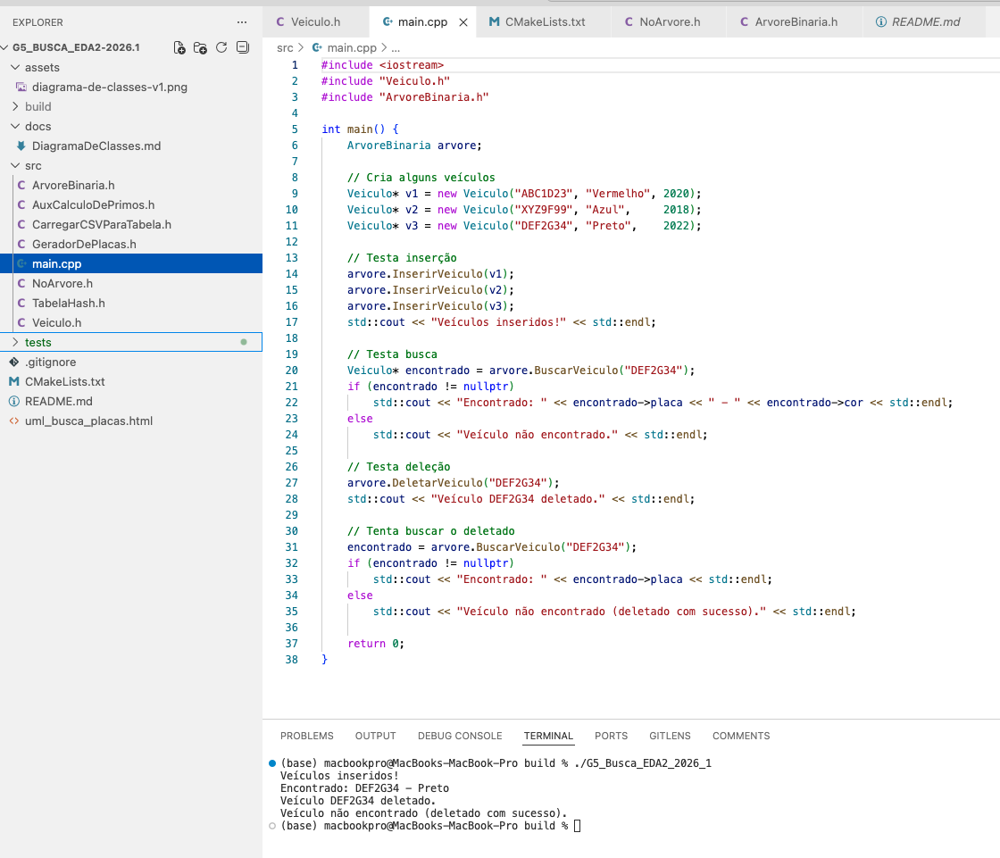
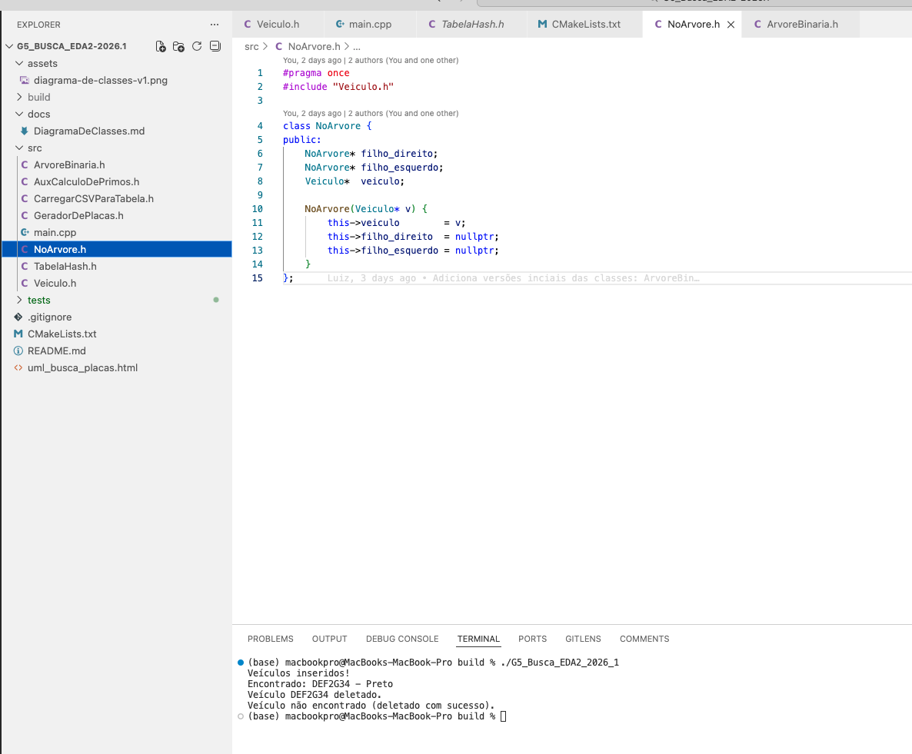
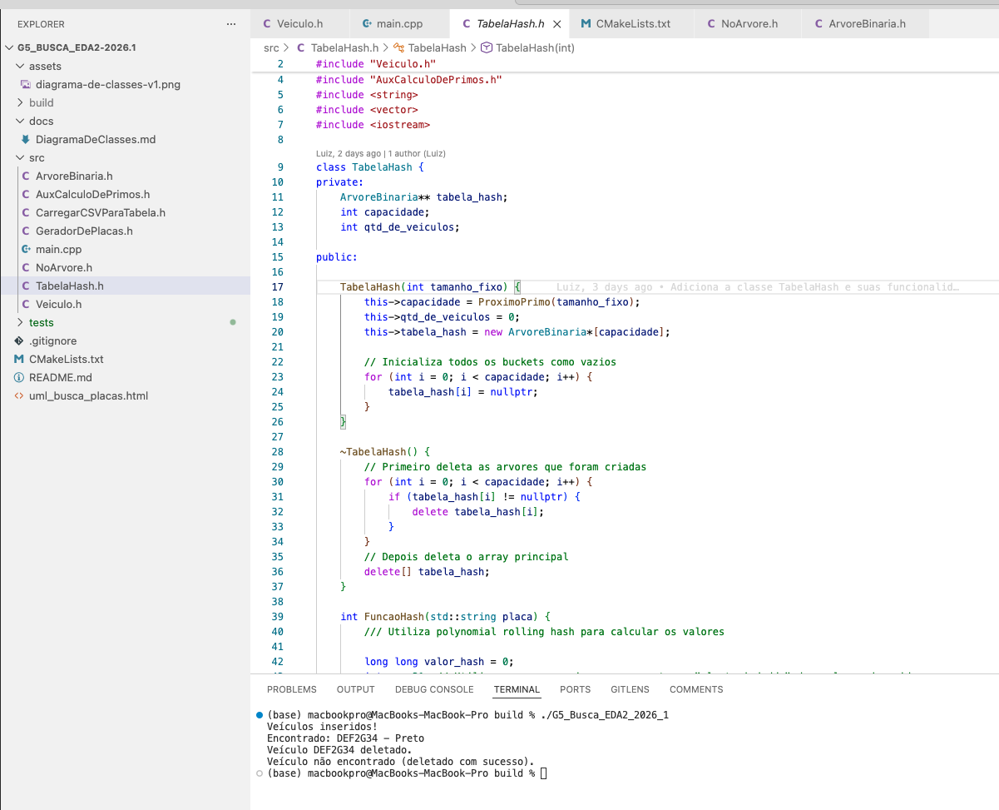

# G5_Busca_EDA2-2026.1

# Busca_BuscaDePlacasVeiculares

Número da Lista: G5
Conteúdo da Disciplina: Algoritmos de Busca<br>

## Alunos

| Matrícula | Aluno |
| -- | -- |
| 23/1030771 | Henrique F G Passos |
| 23/1011696 | Luiz Guilherme Morais da Costa Faria |

## Sobre

O projeto implementa um sistema eficiente de busca de veículos por placa, combinando duas estruturas de dados: **Tabela Hash** e **Árvore Binária de Busca**.

A Tabela Hash distribui os veículos em buckets usando uma função hash baseada na placa do veículo. Dentro de cada bucket, uma Árvore Binária de Busca organiza os veículos em ordem alfabética de placa, permitindo buscas eficientes.

O sistema é composto por 4 classes principais:

- **Veiculo:** armazena os dados do veículo (placa, cor e ano)
- **NoArvore:** nó da árvore binária, com ponteiros para os filhos esquerdo e direito
- **ArvoreBinaria:** organiza os veículos dentro de cada bucket, ordenados pela placa
- **TabelaHash:** classe principal que gerencia os buckets e delega as operações para as árvores

A complexidade das operações é **O(log n)**, garantindo eficiência mesmo para grandes volumes de dados. Com 1 milhão de veículos, são necessárias apenas ~20 comparações para encontrar um veículo.

A tabela hash também implementa **redimensionamento automático**: quando o fator de carga ultrapassa 75%, a tabela dobra de tamanho e recalcula as posições de todos os veículos.

## Vídeo de Apresentação

[](https://youtu.be/zzuJoWIiFSc)

## Screenshots





## Instalação

Linguagem: **C++ 17**<br>
Build system: **CMake**<br>

### Pré-requisitos

- CMake 3.26 ou superior
- Compilador C++ (GCC, Clang ou MSVC)

### Passos

**1. Clone o repositório:**
```bash
git clone https://github.com/eda2-2026/G5_Busca_EDA2-2026.1.git
cd G5_Busca_EDA2-2026.1
```

**2. Crie a pasta de build e configure:**
```bash
mkdir build
cd build
cmake ..
```

**3. Compile:**
```bash
make
```

## Uso

Após compilar, execute o projeto com:

```bash
./G5_Busca_EDA2_2026_1
```

O programa irá:
1. Inserir veículos na tabela hash
2. Buscar um veículo pela placa
3. Deletar um veículo
4. Confirmar a deleção buscando novamente

Saída esperada:
```
Veículos inseridos!
Encontrado: DEF2G34 - Preto
Veículo DEF2G34 deletado com sucesso.
Veículo não encontrado (deletado com sucesso).
```

## Outros

### Documetações do projeto

* [Diagrama de Classes do projeto](docs/diagrama-de-classes)
* [Testes Realizados no projeto](docs/testando-a-tabela-hash.md)

### Complexidade

| Operação | Tabela Hash | Árvore Binária | Total |
|---|---|---|---|
| Inserir | O(1) | O(log n) | O(log n) |
| Buscar | O(1) | O(log n) | O(log n) |
| Deletar | O(1) | O(log n) | O(log n) |

### Possíveis melhorias

- Substituir a Árvore Binária por uma **Árvore AVL**, que se rebalanceia automaticamente e garante O(log n) mesmo no pior caso
- Carregar os dados diretamente de um arquivo CSV com o `GeradorDePlacas.h` já implementado no projeto
