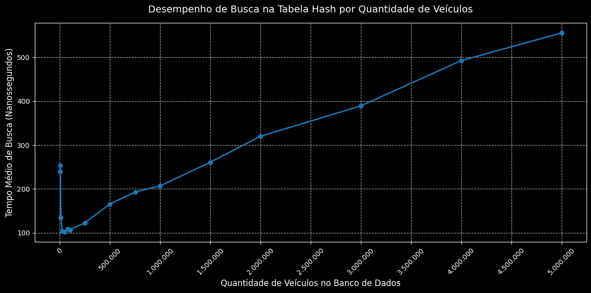

# Testando a Tabela Hash

Após desenvolver as classes: [`TabelaHash`](../src/TabelaHash.h), [`ArvoreBinaria`](../src/ArvoreBinaria.h), [`NoArvore`](../src/NoArvore.h) e [`Veiculo`](../src/Veiculo.h); é necessário testá-las num banco de dados fictício para garantir que as classes foram devidamente integradas e que a tabela hash é capaz de garantir uma consulta em tempo linear, ou seja, O(1).

Para fazer isso, antes foram desenvolvidos alguns trechos de código que auxiliam na otimização das funcionalidades da tabela hash, são eles:

1. [`CarregarCSVParaTabela`](../src/CarregarCSVParaTabela.h);
2. [`GeradorDePlacas`](../src/GeradorDePlacas.h).

## CarregarCSVParaTabela

É um _script_ que automatiza a funcionalidade de carregar os dados de um arquivo .csv para uma tabela hash já criada.

```cpp
void CarregarCSVParaTabela(std::string nome_arquivo, TabelaHash& tabela, std::vector<std::string>& alvos_de_busca) {
    std::ifstream arquivo(nome_arquivo);
    std::string linha, placa, cor, ano_str;

    if (!arquivo.is_open()) {
        std::cout << "Erro ao abrir o CSV para leitura." << std::endl;
        return;
    }

    // Pula a primeira linha do arquivo csv, o cabecalho
    std::getline(arquivo, linha);

    int contador = 0;

    // Le linha a linha do arquivo csv
    while (std::getline(arquivo, linha)) {
        std::stringstream ss(linha);
        std::getline(ss, placa, ',');
        std::getline(ss, cor, ',');
        std::getline(ss, ano_str, ',');

        // Cria um veiculo e insere ele na tabela hash
        Veiculo* v = new Veiculo(placa, cor, std::stoi(ano_str));
        tabela.InserirVeiculo(v);

        // A cada 500 carros e salvo a placa de um carro para ser utilizada nos testes
        if (contador % 500 == 0) {
            alvos_de_busca.push_back(placa);
        }
        contador++;
    }
    arquivo.close();
}
```

## GeradorDePlacas

É um _script_ que automatiza a geração de placas e outras informações de um veículo, ele gera os dados de forma aleatória para popular o banco de dados.

```cpp
std::string GerarPlacaAleatoria() {
    std::string placa = "";

    // Gera tres letras aleatorias
    for (int i = 0; i < 3; i++) {
        placa += (char)('A' + rand() % 26);
    }

    // Gera um numero aleatorio
    placa += std::to_string(rand() % 10);

    // Gera uma letra aleatoria
    placa += (char)('A' + rand() % 26);

    // Gera dois numeros aleatorios
    placa += std::to_string(rand()%10);
    placa += std::to_string(rand()%10);

    return placa;
}

void GerarBancoDeDadosCSV(int quantidade_de_carros, std::string nome_do_arquivo) {
    std::ofstream arquivo(nome_do_arquivo);

    if (!arquivo.is_open()) {
        std::cout << "Erro ao criar o arquivo CSV." << std::endl;
        return;
    }

    arquivo << "Placa,Cor,Ano\n";

    // Vetor com opcoes de cores para serem sorteadas
    std::vector<std::string> cores = {"Branco", "Preto", "Prata", "Cinza", "Vermelho", "Azul"};

    for (int i = 0; i < quantidade_de_carros; i++) {
        std::string placa = GerarPlacaAleatoria();
        std::string cor = cores[rand() % cores.size()];
        int ano = 1990 + (rand() % 37); // Sorteia um ano entre 1990 e 2026

        // Escreve a linha no formato: Placa,Cor,Ano
        arquivo << placa << "," << cor << "," << ano << "\n";
    }

    arquivo.close();
    std::cout << "Sucesso: " << nome_do_arquivo << " gerado com " << quantidade_de_carros << " veículos." << std::endl;
}
```

## Criação dos Testes

Com o auxílio desses dois trechos de código, podemos criar um arquivo em C++ que realizará os testes de desempenho da tabela hash.

Assim, temos o bloco de código:

```cpp
int main() {
    // Inicializa uma semente aleatoria
    srand(time(NULL));

    // Este vetor contem todos as capacidades que testaremos na tabela hash
    // primeiro testaremos uma tabela de mil veiculos, depois 5 mil e assim
    // por diante
    std::vector<int> tamanhos_teste = {
        1000,       // 1 mil
        5000,       // 5 mil
        10000,      // 10 mil
        25000,      // 25 mil
        50000,      // 50 mil
        75000,      // 75 mil
        100000,     // 100 mil
        250000,     // 250 mil
        500000,     // 500 mil
        750000,     // 750 mil
        1000000,    // 1 milhao
        1500000,    // 1.5 milhoes
        2000000,    // 2 milhoes
        3000000,    // 3 mihloes
        4000000,    // 4 mihloes
        5000000     // 5 milhoes
    };

    std::cout << "\nIniciando testes com a tabela hash de veiculos...\n";

    for (int quantidade_de_veiculos : tamanhos_teste) {
        std::string nome_arquivo = "banco_" + std::to_string(quantidade_de_veiculos) + ".csv";

        // Primeiro, chama a funcao para gerar um banco de dados em csv com
        // (quantidade_de_veiculos) veiculos
        GerarBancoDeDadosCSV(quantidade_de_veiculos, nome_arquivo);

        // Segundo, cria uma tabela hash
        // Por padrao do projeto, todas as tabelas hash comecam com 10007 buckets
        TabelaHash tabela(10007);

        // Terceiro, guardamos em um vetor todas as placas que serao utilizadas
        // para testar a eficiencia da tabela hash
        // quanto mais veiculos tiver o csv, maior sera o vetor de veiculos
        std::vector<std::string> placas_de_teste;
        CarregarCSVParaTabela(nome_arquivo, tabela, placas_de_teste);

        // Quarto, iniciamos o cronometro
        auto inicio = std::chrono::high_resolution_clock::now();

        int repeticoes = 10000;
        int encontrados_sucesso = 0; // Mede quantos veiculos foram encontrados na consulta da tabela hash

        for (int i = 0; i < repeticoes; i++) {
            // Pegamos uma placa diferente do vetor de placas de teste
            std::string placa_da_vez = placas_de_teste[i % placas_de_teste.size()];

            Veiculo* encontrado = tabela.BuscarVeiculo(placa_da_vez);

            if (encontrado != nullptr) {
                encontrados_sucesso++;
            }
        }

        // Para o cronômetro
        auto fim = std::chrono::high_resolution_clock::now();
        // =======================================================

        // Quinto, calculamos o tempo gasto em nanossegundos
        auto duracao_total = std::chrono::duration_cast<std::chrono::nanoseconds>(fim - inicio).count();

        // Divide o tempo total pelas 10.000 repetições para ter o tempo exato de UMA única busca
        auto tempo_medio_por_busca = duracao_total / repeticoes;

        // Sexto, imprime o resultado do teste atual
        std::cout << "Quantidade de veículos: " << quantidade_de_veiculos << ","
        << " Tempo médio por busca: "<< tempo_medio_por_busca << " nanossegundos"
        << "\n" << std::endl;

        if (encontrados_sucesso == 0) std::cout << "";
    }

    return 0;
}
```

Este bloco de código realiza 16 testes de desempenho com a tabela hash. Para isso, cabe destacar algumas informações:

1. Em todos os testes a tabela hash começa com o tamanho fixo de 10007 buckets. Caso o seu fator de carga ultrapasse 75%, a tabela automaticamente encontra o primo mais próximo depois do dobro da sua capacidade anterior.
2. Quanto maior é a quantidade de veículos que está numa tabela hash, maior será o número de consultas feitas para avaliar o seu desempenho.

Assim, após rodar os testes, organizamos os resultados na Tabela 1.

**Tabela 1:** Resultados dos testes de desempenho aplicados na tabela hash criada.

| Caso de Teste | Quantidade de Veículos | Tamanho Inicial da Tabela | Tamanho Final da Tabela | Quantidade de Redimensionamentos | Tempo Médio de Busca (ns) |
| :---: | :---: | :---: | :---: | :---: | :---: |
| 1 | 1.000 | 10.007 | 10.007 | 0 | 254 |
| 2 | 5.000 | 10.007 | 10.007 | 0 | 240 |
| 3 | 10.000 | 10.007 | 20.021 | 1 | 135 |
| 4 | 25.000 | 10.007 | 40.063 | 2 | 105 |
| 5 | 50.000 | 10.007 | 80.141 | 3 | 102 |
| 6 | 75.000 | 10.007 | 160.309 | 4 | 109 |
| 7 | 100.000 | 10.007 | 160.309 | 4 | 107 |
| 8 | 250.000 | 10.007 | 641.261 | 6 | 123 |
| 9 | 500.000 | 10.007 | 1.282.529 | 7 | 166 |
| 10 | 750.000 | 10.007 | 1.282.529 | 7 | 193 |
| 11 | 1.000.000 | 10.007 | 2.565.061 | 8 | 207 |
| 12 | 1.500.000 | 10.007 | 2.565.061 | 8 | 261 |
| 13 | 2.000.000 | 10.007 | 5.130.143 | 9 | 320 |
| 14 | 3.000.000 | 10.007 | 5.130.143 | 9 | 389 |
| 15 | 4.000.000 | 10.007 | 10.260.301 | 10 | 492 |
| 16 | 5.000.000 | 10.007 | 10.260.301 | 10 | 555 |

**Autor:** [Luiz Faria](https://github.com/luizfaria1989).

Ou em forma de gráfico como retratado na Figura 1.

**Figura 1:**: Representação gráfica do desempenho de consultas na tabela hash conforme o número de veículos nela aumenta.


**Autor:** [Luiz Faria](https://github.com/luizfaria1989).

## Considerações Sobre Os Testes

Analisando a Tabela 1, percebemos que entre o primeiro e o décimo segundo teste as variações do tempo de consulta na tabela hash permanecem aproximadamente constantes, variando de 102 até 261 ns.

Contudo, quando a partir do décimo terceiro teste, vemos o tempo de consulta aumentar, chegando até 555 ns no último teste realizado. 

A primeira vista, podemos nos enganar (assim como aconteceu comigo ao rodar os testes), e pensar que existe alguma falha no código da tabela hash que esteja aumentando o tempo de consultas, saindo do tempo linear. Contudo, a resposta para este problema não está presente no _software_ produzido, existe uma grande possibilidade que o tempo de consulta tenha aumentado devido ao _hardware_ utilizado.

Ao aumentarmos o número de linhas de uma tabela, estamos também aumentando a quantidade de bytes gasta para armazenar a tabela. As tabelas iniciais, são pequenas, quando comparadas as tabelas dos testes iniciais, e aí surge um problema. Se uma tabela em pequena, digamos 10Kb [ver Figura 2](../assets/info-caso-de-teste-1.png), essa tabela pode ser armazenada inteiramente na memória cache de um processador. Contudo, o mesmo não acontece nas tabelas maiores, que chegam a pesar quase 100Mb [ver Figura 3](../assets/info-caso-de-teste-16.png).

Dessa forma, nas tabelas menores, as consultas feitas na tabela hash são em tabelas armazenadas no cache, por isso uma resposta quase instantânea. Mas as tabelas maiores estão armazenadas na sua maioria na memória RAM, o que atrasa o desempenho.

## Histórico de Versões

| Versão | Descrição                        | Data       | Autor |
|--------|----------------------------------|------------|-------|
| 0.1 | Criação e documentação da página | 05/04/2026 | [Luiz Faria](https://github.com/luizfaria1989) |